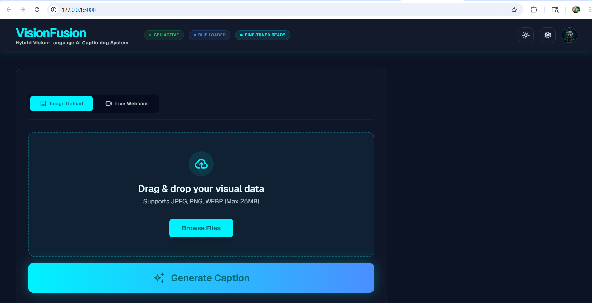
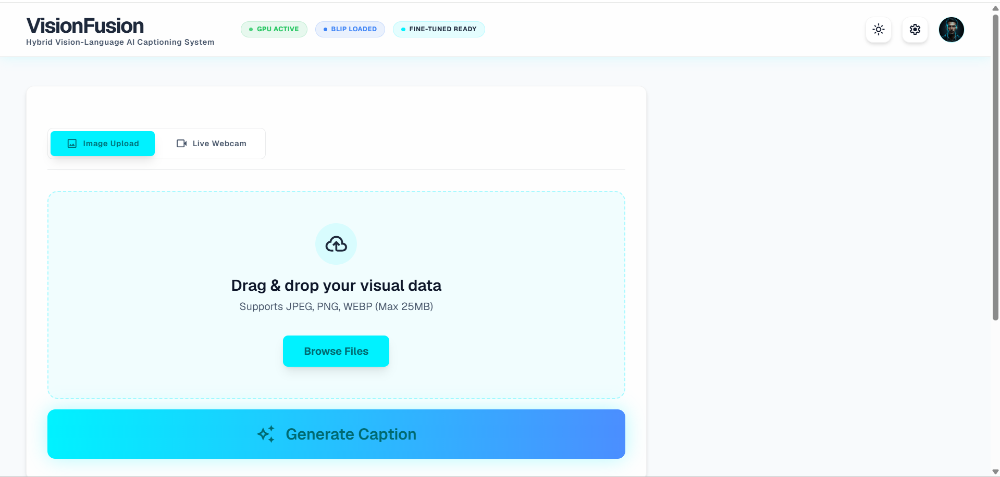
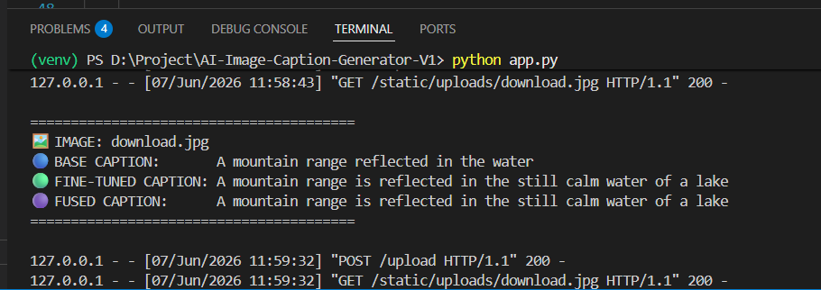
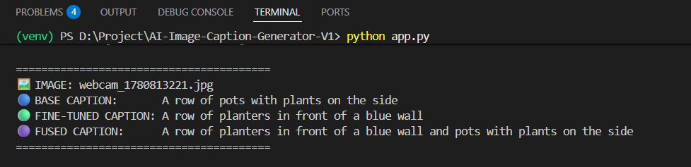
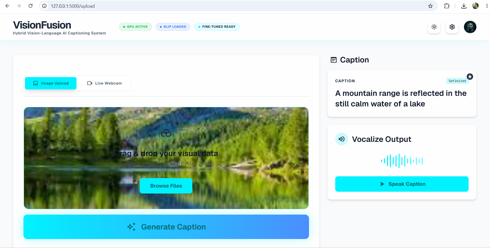

<<<<<<< HEAD
# VisionFusion – Hybrid Vision-Language AI Captioning System

VisionFusion is a hybrid AI-powered image captioning system built using Salesforce BLIP, PyTorch, Flask, and CUDA GPU acceleration. The project combines a pre-trained BLIP model with a custom fine-tuned Flickr8k model to generate more detailed, context-aware, and human-like image captions.

The system supports:

* Image upload captioning
* Live webcam captioning
* Hybrid caption generation
* Text-to-speech narration
* Modern futuristic UI
* Light and dark theme support
* CUDA GPU acceleration
* Fine-tuned transformer training
* Mid-epoch checkpoint recovery

---

# Features

## AI Caption Generation

* Base BLIP caption generation
* Fine-tuned BLIP caption generation
* Hybrid caption refinement system
* Context-aware image understanding

## Input Modes

* Upload image from device
* Live webcam capture support
* Drag-and-drop image upload

## Voice Support

* Text-to-speech caption narration
* Audio playback
* Caption voice output generation

## Modern Frontend

* Futuristic AI-themed interface
* Glassmorphism UI
* Responsive layout
* Light and dark mode support
* Animated transitions and interactions

## Training System

* BLIP fine-tuning on Flickr8k dataset
* CUDA GPU acceleration
* Gradient accumulation support
* Mid-epoch checkpoint saving
* Resume training after interruption or power cuts

---

# Working of the Project

The VisionFusion system follows a hybrid vision-language AI pipeline for generating image captions.

## Step 1 – Image Input

The user can:

* Upload an image from their device
  OR
* Capture an image using the live webcam interface.

The selected image is previewed instantly on the frontend.

---

## Step 2 – Image Preprocessing

The image is processed using the BLIP processor from HuggingFace Transformers.

Processing includes:

* image resizing
* normalization
* tensor conversion

before sending the image to the AI model.

---

## Step 3 – Base BLIP Caption Generation

The pre-trained Salesforce BLIP model generates a base caption describing the image.

This provides:

* general scene understanding
* object recognition
* natural language description

---

## Step 4 – Fine-Tuned BLIP Caption Generation

The fine-tuned BLIP model, trained on the Flickr8k dataset, generates a more context-aware caption.

Fine-tuning improves:

* scene detail understanding
* descriptive quality
* contextual captioning

---

## Step 5 – Hybrid Caption Refinement

The system compares:

* Base BLIP caption
* Fine-Tuned BLIP caption

and intelligently selects/refines the better caption to create a cleaner and more human-like final output.

---

## Step 6 – Text-to-Speech Narration

The final generated caption can be converted into audio narration using the text-to-speech module.

Users can:

* play generated narration
* listen to captions
* download generated audio

---

## Step 7 – Frontend Display

The generated captions and audio controls are displayed in a modern futuristic frontend interface supporting:

* light mode
* dark mode
* responsive layouts
* animated AI interactions

---

## Training Pipeline

The fine-tuned model was trained using:

* PyTorch
* CUDA GPU acceleration
* mixed precision training (AMP)
* gradient accumulation
* checkpoint recovery system

The training pipeline also supports:

* mid-epoch checkpoint saving
* resume training after interruption
* VRAM optimization for RTX 3050 GPUs

---

# Tech Stack

## Backend

* Python
* Flask
* PyTorch
* HuggingFace Transformers

## AI Models

* Salesforce BLIP
* Fine-Tuned BLIP Model

## Frontend

* HTML
* CSS
* JavaScript

## Hardware

* NVIDIA RTX 3050 6GB Laptop GPU
* CUDA Acceleration

---

# Project Structure

```bash
AI-Image-Caption-Generator/
│
├── app.py
├── train.py
├── config.py
├── dataset.py
├── requirements.txt
├── test_model.py
├── gpu_test.py
├── voice_test.py
├── README.md
├── .gitignore
│
├── templates/
│   └── index.html
│
├── static/
│   ├── style.css
│   ├── audio/
│   └── uploads/
│
├── model/
│   └── checkpoints/
│
└── dataset/
    └── flickr8k/
```

---

# Important Note About Missing Files

To keep the GitHub repository lightweight and manageable, the following files and folders were intentionally NOT uploaded:

* Flickr8k dataset
* Trained model checkpoints
* Python virtual environment (venv)
* Generated audio files
* Uploaded temporary images

You MUST manually set these up locally before running the project.

---

# Dataset Setup

## Step 1 – Download Flickr8k Dataset

Download the Flickr8k dataset manually.

Dataset contains:

* Images
* Caption annotations
* Train/validation/test splits

---

## Step 2 – Create Dataset Structure

```bash
dataset/
└── flickr8k/
    ├── images/
    ├── captions/
    └── splits/
```

---

## Step 3 – Place Dataset Files

### Inside `images/`

Place all Flickr8k images.

### Inside `captions/`

Place:

```bash
captions.txt
```

### Inside `splits/`

Place:

```bash
train.txt
val.txt
test.txt
```

---

# Python Environment Setup

## Step 1 – Create Virtual Environment

```bash
python -m venv venv
```

---

## Step 2 – Activate Virtual Environment

### Windows

```bash
venv\Scripts\activate
```

### Linux/macOS

```bash
source venv/bin/activate
```

---

# Install Dependencies

```bash
pip install -r requirements.txt
```

---

# CUDA GPU Setup

To verify CUDA:

```bash
python gpu_test.py
```

Expected output:

```bash
CUDA Available: True
```

---

# Running the Application

```bash
python app.py
```

Application will run at:

```bash
http://127.0.0.1:5000
```

---

# Training the Model

```bash
python train.py
```

---

# Training Features

The training pipeline supports:

* Automatic checkpoint saving
* Resume training after interruption
* Mid-epoch checkpoint recovery
* Gradient accumulation
* Mixed precision training (AMP)
* CUDA optimization

---

# Resume Training

To resume training from a checkpoint:

1. Open `config.py`
2. Set:

```python
RESUME_CHECKPOINT = "model/checkpoints/epoch_1_batch_1200"
```

3. Run:

```bash
python train.py
```

Training will continue from the saved batch.

---

# Important Configuration Parameters

```python
BATCH_SIZE = 2
EPOCHS = 1
LEARNING_RATE = 1e-5
GRADIENT_ACCUMULATION_STEPS = 2
CHECKPOINT_SAVE_INTERVAL = 100
```

---

# Why Checkpoints Are Not Uploaded

Model checkpoints are intentionally excluded from GitHub because:

* Large file size
* GitHub storage limitations
* Faster repository cloning
* Cleaner repository structure

You can train your own checkpoints locally.

---

# Webcam Support

The application supports:

* Live webcam access
* Real-time image capture
* Instant AI caption generation

Browser camera permissions must be enabled.

---

# Text-to-Speech Support

Generated captions can be converted into audio narration.

Features:

* Speak generated captions
* Audio playback
* Download generated narration

---

# Frontend Features

* Futuristic AI dashboard UI
* Responsive design
* Light mode
* Dark mode
* Smooth animations
* AI-style glowing effects
* Modern upload interface
* Webcam integration

---

# Known Limitations

* Fine-tuned model quality depends on training duration
* Caption fusion may occasionally generate imperfect grammar
* CPU inference may be slower than CUDA inference
* Webcam quality depends on browser/device permissions

---

# Future Improvements

Planned upgrades:

* Better caption fusion algorithms
* Real-time streaming caption generation
* Video captioning
* Multilingual caption support
* Mobile app version
* Better grammar correction
* Larger fine-tuning datasets
* Faster inference optimization

---

# Screenshots

## Dark Theme


---

## Light Theme


---

## Upload Captioning


---

## Webcam Captioning


---

## Caption Result


---

# Demo Videos

## Upload Caption Demo
demo/upload-demo.mp4

## Webcam Caption Demo
demo/webcam-demo.mp4

---

# GitHub Notes

The following folders are excluded using `.gitignore`:

```bash
venv/
dataset/
model/checkpoints/
static/audio/
static/uploads/
```

---
=======
# AI-Image-Caption-Generator
VisionFusion is a hybrid AI image captioning system built using BLIP, PyTorch, Flask, and CUDA GPU acceleration. It combines a base BLIP model with a fine-tuned Flickr8k model to generate detailed captions with webcam support, text-to-speech narration, and a modern light/dark futuristic UI.
>>>>>>> 7853637 (Added screenshots and demo videos)
